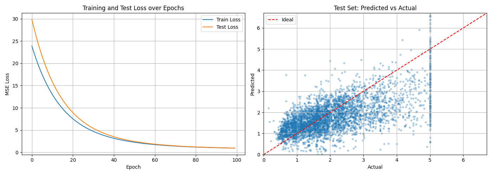
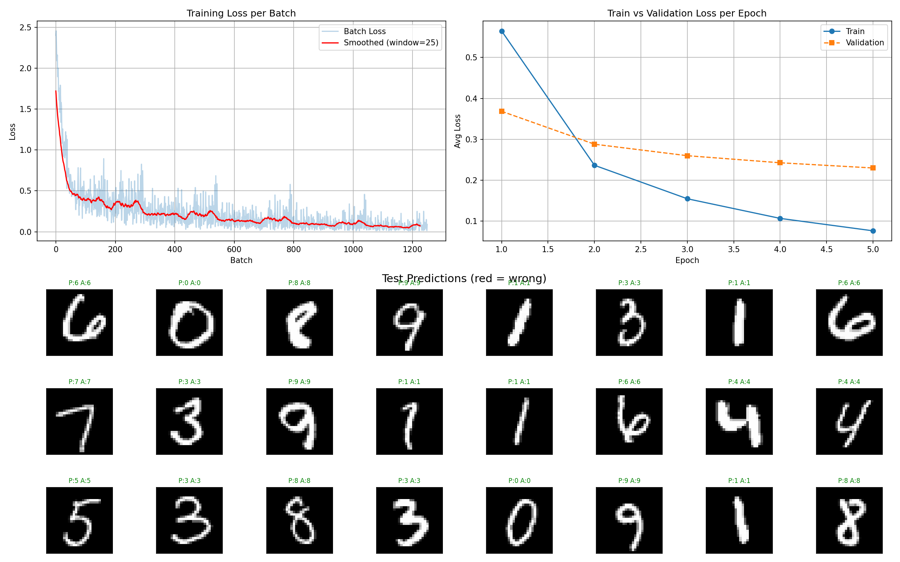

# deeplygrad

A tiny autograd engine and neural network library built from scratch on NumPy/CuPy. Built for learning  - every operation records its gradient function, forming a computation graph that `backward()` traverses via reverse-mode autodiff.

## Why?

Just for fun and learning! Not intended for production use. It is for educational purposes only explaining what is happening under the hood when we call `loss.backward()` to train our models.

## Features

### Tensor & Autograd (`deeplygrad/tensor.py`)

A `Tensor` class wrapping NumPy/CuPy arrays with automatic differentiation:

- **Arithmetic**: add, mul, sub, div, neg, pow
- **Matrix ops**: matmul (`@` operator), transpose
- **Reductions**: sum, mean, max (with axis support)
- **Unary ops**: exp, log
- **Shape ops**: reshape, indexing (`__getitem__`)
- **Comparison**: `>`, `<`, `>=`, `<=`, `==` and `where()`
- **Autograd**: reverse-mode autodiff via topological sort of the computation DAG

Every operation builds a graph. Calling `.backward()` walks it in reverse, applying the chain rule at each node.

### Neural Network Layers (`deeplygrad/nn.py`)

Built on top of the Tensor autograd:

| Component | Description |
|-----------|-------------|
| `Module` | Base class with `parameters()`, `zero_grad()`, `train()`/`eval()` |
| `Linear` | Fully-connected layer with Kaiming initialization |
| `ReLU` | ReLU activation |
| `GELU` | GELU activation |
| `MSELoss` | Mean squared error loss |
| `CrossEntropyLoss` | Cross-entropy with numerically stable log-softmax (custom backward) |

### Optimizers (`deeplygrad/optim.py`)

| Optimizer | Description |
|-----------|-------------|
| `SGD` | Stochastic gradient descent with optional momentum |
| `Adam` | Adam optimizer with bias correction |

All optimizers inherit from an `Optimizer` base class that provides shared `parameters`, `lr`, and `zero_grad()`.

### Backend (`deeplygrad/backend.py`)

Seamlessly switch between CPU (NumPy) and GPU (CuPy) with zero code changes:

```python
from deeplygrad.backend import xp  # numpy or cupy, auto-detected

# Or force a backend:
# DEEPLYGRAD_BACKEND=numpy python your_script.py
# DEEPLYGRAD_BACKEND=cupy  python your_script.py
```

## Examples

### Linear Regression (`linear_regression/`)

Linear regression on the California Housing dataset using raw Tensor operations (no `nn.Module`):

```bash
python linear_regression/linear_regression.py
```

Trains a linear model with gradient descent, producing loss curves and predicted vs actual values:



### MNIST Classification (`neural_network/`)

A 3-layer MLP (784 -> 128 -> 64 -> 10) trained on MNIST with Adam optimizer and cross-entropy loss:

```bash
python neural_network/mnist.py
```

Produces training/validation loss curves and a grid of test predictions:



## Testing

All gradient tests verify analytic gradients against numerical (finite-difference) gradients:

```bash
python -m pytest tests/ -v
```

## Installation

```bash
pip install -e .
```

Requires NumPy. CuPy is optional (for GPU support).
